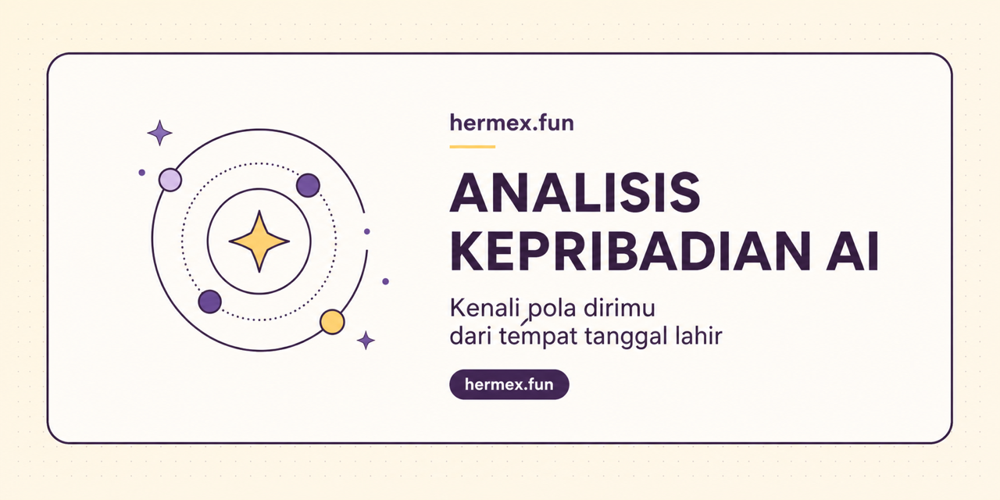

# Hermex Fun

Hermex is an open-source personality analysis app based on birth place, date,
and time. It combines a natal calculation, a short 1–5 questionnaire, and an
AI-assisted interpretation for reflective self-discovery—not deterministic
medical, legal, financial, or life advice.

Website: **https://hermex.fun**
Repository: **https://github.com/wauputr4/hermex**

## How it works

1. Enter a birth date, optional birth time, and birth location. When time is
   omitted, Hermex uses `00:00` and clearly marks the result as less precise.
2. Answer ten plain-language statements from 1 to 5. When an AI provider is
   configured, the backend creates the questions from the calculated signals;
   local and test environments can use a deterministic fallback.
3. Receive a guest preview and editable username suggestions. Google login
   unlocks the complete analysis and the detailed natal-chart view.

The browser receives one question id and prompt at a time plus the rating scale,
so the currently displayed question remains inspectable. Internal chart signals,
the system prompt, the remaining questions, and the complete interpretation stay
on the backend until the relevant request needs them.

Berita Langit remains available as article cards below the main analysis flow.

## Quick start

### Backend

```bash
cd backend
cp .env.example .env
python3.11 -m pip install -r requirements.txt
python3.11 -m uvicorn app.main:app --host 127.0.0.1 --port 5667 --reload
```

### Frontend

```bash
cd frontend
cp .env.example .env
npm install
npm run dev -- --host 127.0.0.1 --port 5666
```

Open `http://127.0.0.1:5666`.

## Environment and AI provider

Backend configuration lives in `backend/.env`. Start from
[`backend/.env.example`](backend/.env.example), then configure at minimum:

```env
LLM_PROVIDER=openai_compat
LLM_BASE_URL=https://api.openai.com/v1
LLM_API_KEY=your_api_key
LLM_MODEL=gpt-4o-mini
```

Provider settings can also be updated through the admin dashboard. Local
SQLite settings override `.env` values. Never commit real API keys, OAuth
secrets, admin credentials, or production session secrets.

See [`docs/LLM_INTEGRATION.md`](docs/LLM_INTEGRATION.md) for the provider
contract and [`docs/DEPLOYMENT.md`](docs/DEPLOYMENT.md) for production settings.

## Admin dashboard

The frontend and admin dashboard use one public port:

```text
http://127.0.0.1:5666/admin/dashboard
```

Vite forwards `/admin/*` to FastAPI on port `5667` during local development.

Local credentials:

```text
username: admin
password: hermes-admin
```

These defaults are for localhost only. Replace the password and session secret
with strong, unique values before exposing Hermex outside local development.

## Google authentication

Hosted full results require a Google session and profile ownership. Configure:

```env
GOOGLE_CLIENT_ID=your_google_client_id.apps.googleusercontent.com
GOOGLE_CLIENT_SECRET=your_google_client_secret
GOOGLE_REDIRECT_URI=http://127.0.0.1:5666/api/v1/auth/google/callback
GOOGLE_SESSION_SECRET=replace_with_a_strong_secret
```

Add the exact same callback to the OAuth client's **Authorized redirect URIs**
in Google Cloud Console. For local development that URI is:
`http://127.0.0.1:5666/api/v1/auth/google/callback`. `localhost`, another port,
or a different path is treated as a different URI by Google.

The guest analysis is linked to the signed-in account through the existing
profile claim flow. Guests and other accounts cannot fetch the complete result.
Self-hosted operators may explicitly set `SELF_HOSTED_FULL_ACCESS=true`.

## Tests and documentation

```bash
(cd backend && .venv/bin/python -m unittest discover -s tests -v)
cd frontend && npm run build
```

- [Development guide](docs/DEVELOPMENT.md)
- [Architecture and API contract](docs/ARCHITECTURE.md)
- [LLM integration](docs/LLM_INTEGRATION.md)
- [Deployment guide](docs/DEPLOYMENT.md)
- [Contributing](CONTRIBUTING.md)
- [Security policy](SECURITY.md)

Public legal pages are available at `/terms` and `/privacy`.

## License

MIT
